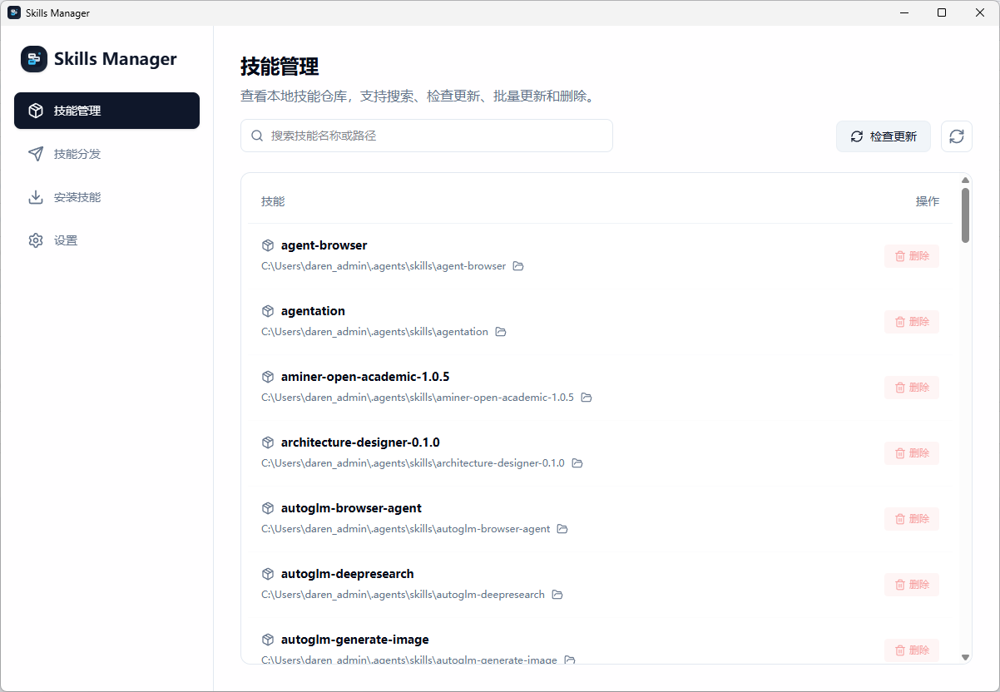
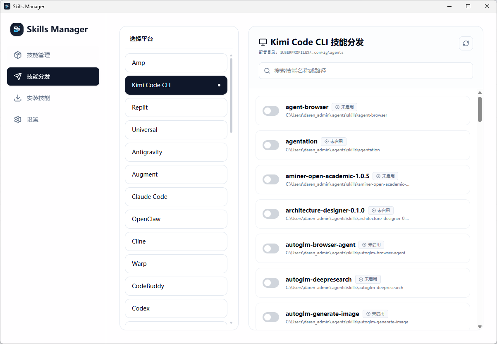
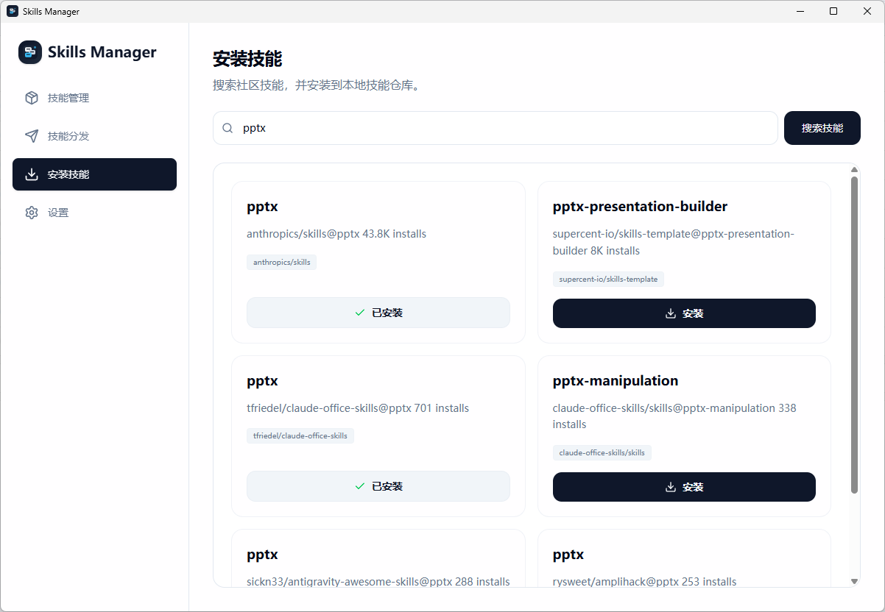
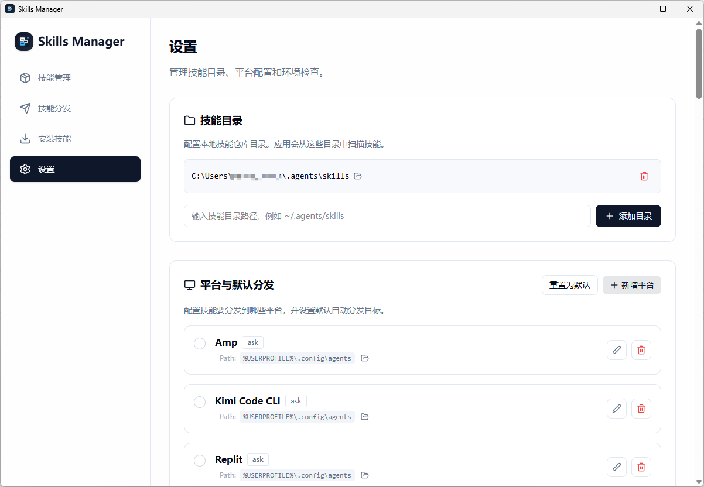

# Skills Manager

Skills Manager 是一个基于 Tauri + React 的桌面应用，用来管理本地技能仓库，并把技能分发到不同 AI 客户端或代理的技能目录。

它聚焦 4 件事：

- 管理本地技能仓库，支持搜索、刷新、检查更新、批量更新和删除。
- 搜索社区技能，并一键安装到本地仓库。
- 将技能分发到不同平台目录，支持 `symlink`、`copy` 和按需选择。
- 管理技能目录、默认分发平台和运行环境检查。

## 适用对象

- 维护自己的 AI Skills / Agent Skills 仓库的个人开发者
- 同时使用 Codex、Claude Code、Cursor、OpenCode、Kimi Code CLI 等多个客户端的用户
- 需要把一份技能仓库同步到多个工具目录的工作流使用者

## 界面预览

### 技能管理



### 技能分发



### 安装技能



### 设置



## 快速开始

### 前置依赖

- Node.js 22+
- `pnpm` 10.x
- Rust stable
- 当前操作系统所需的 Tauri 系统依赖
- 已安装可用的 `Skills CLI`

### 本地开发

```bash
pnpm install
pnpm tauri:dev
```

应用启动后会先做环境检查；如果本机缺少 `Skills CLI`，请先安装并确保命令可用。

## 从源码运行

### 1. 安装依赖

```bash
pnpm install
```

### 2. 启动开发环境

```bash
pnpm tauri:dev
```

### 3. 构建前端与桌面包

```bash
pnpm build
pnpm tauri:build
```

按宿主平台也可以分别构建：

```bash
pnpm tauri:build:windows
pnpm tauri:build:macos
```

## 从 Releases 获取

项目支持通过 GitHub Releases 分发桌面安装包。

- Windows：下载最新 Release 中的 NSIS `.exe` 安装包
- macOS：下载最新 Release 中的 `.dmg`

如果某个版本还没有公开 Release，优先使用“从源码运行”方式启动。当前仓库已经包含 Release 工作流，后续正式打标签后即可生成对应安装包。

## 常见开发命令

```bash
pnpm tauri:dev
pnpm build
pnpm release:validate
pnpm release:sync
pnpm release:prepare 0.1.1
pnpm tauri:build
pnpm tauri:build:windows
pnpm tauri:build:macos
```

## 项目结构

```text
src/                  React 前端界面与状态管理
src-tauri/            Tauri / Rust 桌面端实现
public/screenshot/    README 使用的界面截图
scripts/release/      版本同步与打包辅助脚本
docs/                 产品与发版相关文档
```

## 已知说明

- 当前仓库没有写入 GitHub 仓库专属链接字段；等最终公开仓库地址确定后，再补 `repository`、`homepage`、`bugs` 等元信息。
- Release 打包链路已存在，但签名和 notarization 是否启用，取决于后续是否配置对应 secrets。
- README 当前直接使用现有截图，未额外做脱敏处理。

## 贡献方式

欢迎提交 Issue 和 Pull Request。开始贡献前，请先阅读：

- [贡献指南](./CONTRIBUTING.md)
- [安全策略](./SECURITY.md)
- [行为准则](./CODE_OF_CONDUCT.md)

## 许可证

本项目采用 [MIT License](./LICENSE)。
